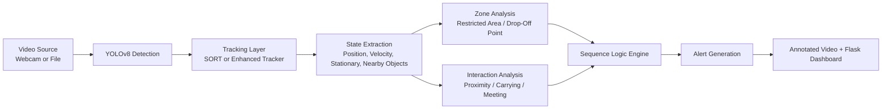

# EPSAD

**Edge Powered Sequential Anomaly Detection**

EPSAD is a computer-vision surveillance prototype focused on **edge-level event monitoring**, **temporal sequence understanding**, and **real-time anomaly signaling**. Instead of stopping at raw object detection, the project layers tracking, zone reasoning, interaction analysis, and rule-based sequence logic to identify higher-level deviations such as unattended bags, restricted-zone presence, and loitering.

## Project Snapshot

- Designed as an **edge-powered sequential anomaly detection framework**
- Monitors **temporal event streams** from a live camera or video source
- Combines **YOLOv8 detection**, **tracking**, **zone/state analysis**, and **sequence-driven alerting**
- Includes a **live Flask dashboard** for visual monitoring, alert review, and lightweight system stats
- Structured as an **incremental pipeline**, starting from video I/O and growing into a full intelligent surveillance demo

## What Makes EPSAD Different

Many vision projects stop at "an object was detected." EPSAD pushes further by asking:

- Is the object moving or stationary?
- Did a person enter a restricted region and stay there too long?
- Was a bag near a person, then dropped, then left unattended?
- Are two entities interacting in a way that may indicate a suspicious sequence?

That is the core idea of EPSAD: **anomaly detection through event progression, not just per-frame classification**.

## Core Capabilities

- Real-time video ingestion from webcam or file
- YOLOv8-based object detection
- Object tracking with both:
  - a classic **SORT** pipeline
  - a more advanced **appearance-aware ReID-style tracker**
- Zone-based spatial reasoning
- Interaction and proximity analysis
- Sequential rule engine for anomaly logic
- Live dashboard with video stream, alerts, acknowledgements, and statistics

## Detection Pipeline



## Repository Structure

```text
.
├── dashboard_server.py          # Flask dashboard and alert APIs
├── debug_test.py                # Basic webcam/OpenCV smoke test
├── detect_and_track.py          # YOLO + SORT tracking pipeline
├── intelligent_system.py        # Advanced integrated EP-SAD pipeline
├── object_detector.py           # Basic YOLO detection demo
├── requirements.txt             # Minimal dependency list currently present
├── sequence_engine.py           # Rule-based sequential anomaly logic
├── sort_tracker.py              # SORT tracker implementation
├── state_analysis_complete.py   # Zone, interaction, and left-behind analysis
├── templates/
│   └── index.html               # Real-time dashboard UI
├── video_reader.py              # Video I/O starter module
└── yolov8n.pt                   # Bundled YOLOv8 nano model weights
```

## Module Guide

### `video_reader.py`
Entry-level utility for opening a webcam or video file and displaying frames. Useful for validating that the video source works before running heavier detection pipelines.

### `object_detector.py`
Wraps YOLOv8 object detection and overlays detections on frames. This is the simplest object-aware stage in the repo.

### `detect_and_track.py`
Builds on object detection by pairing YOLOv8 with a custom `SORT` implementation from `sort_tracker.py`. It focuses on tracked IDs and movement trails for people and common carried objects such as backpacks and handbags.

### `sort_tracker.py`
Implements a Kalman-filter and IOU-association based SORT tracker. This is the classic lightweight tracking path used by the intermediate pipeline.

### `state_analysis_complete.py`
Introduces a richer reasoning layer:

- simple centroid-based tracking
- rectangle and polygon zones
- interaction detection between tracked entities
- left-behind / abandoned object signaling
- annotated overlays for zones, interactions, and alerts

This file represents the transition from raw tracking to **state-aware scene reasoning**.

### `sequence_engine.py`
The heart of the sequential anomaly logic. It defines rule-based event progressions for:

- unattended bag detection
- restricted zone violation
- loitering
- object transfer placeholder logic

The design here is especially important to EPSAD's identity: alerts are triggered from **multi-step state transitions over time**, not just isolated detections.

### `intelligent_system.py`
The most advanced module in the repository. It integrates:

- YOLOv8 detection
- appearance-feature extraction using ResNet50
- multi-stage tracking and re-identification logic
- velocity and stationary-state estimation
- automatic zone checks
- sequence engine integration
- compact in-frame alert panel

This is the closest thing to the project's main "full system" entry point.

### `dashboard_server.py`
Runs a Flask dashboard that:

- streams annotated video
- surfaces live alerts
- exposes system statistics
- allows alert acknowledgement and clearing
- provides a demo alert generator

### `templates/index.html`
A command-center style dashboard UI with:

- live feed panel
- threat assessment panel
- mission status metrics
- geolocation widget
- test alert controls

### `debug_test.py`
Small sanity-check script for OpenCV and webcam availability.

## Supported Anomaly Scenarios

### 1. Unattended Bag Detection
Modeled as a sequence:

1. Person is near or carrying a bag
2. Bag becomes stationary
3. Person moves away
4. Bag remains unattended for a duration threshold

### 2. Restricted Zone Violation
Triggered when an object or person enters a restricted area and remains there beyond the configured time window.

### 3. Suspicious Loitering
Triggered when a person stays stationary inside a sensitive or restricted region for an extended period.

### 4. Left-Behind Object Signals
The state-analysis pipeline also flags stationary baggage-like objects with no nearby person.

## Zone Design

The current implementation programmatically creates demo zones based on frame resolution. The main zones used across the system are:

- `RESTRICTED AREA`
- `DROP-OFF POINT`
- `MEETING ZONE` in the state-analysis pipeline

This makes the project easy to demo quickly, while also showing the intended architecture for configurable spatial policies.

## How To Run

### 1. Clone the repository

```bash
git clone https://github.com/TheNonConformist/Edge-Powered-Sequential-Anomaly-Detection-EP-SAD-.git
cd Edge-Powered-Sequential-Anomaly-Detection-EP-SAD-
```

### 2. Create and activate a virtual environment

```bash
python3 -m venv .venv
source .venv/bin/activate
```

### 3. Install dependencies

The current `requirements.txt` contains only a minimal subset. For the full project, install the core list plus the additional packages used by advanced modules:

```bash
pip install -r requirements.txt
pip install flask ultralytics filterpy torch torchvision pillow
```

Notes:

- `yolov8n.pt` is already included in the repository
- `onnxruntime` appears in `requirements.txt`
- `filterpy`, `flask`, `torch`, `torchvision`, and `pillow` are required by source files but are not currently listed in `requirements.txt`

### 4. Run the module you want

#### Basic video reader

```bash
python3 video_reader.py
python3 video_reader.py path/to/video.mp4
```

#### Object detection

```bash
python3 object_detector.py
python3 object_detector.py path/to/video.mp4
```

#### Detection + SORT tracking

```bash
python3 detect_and_track.py
python3 detect_and_track.py path/to/video.mp4
```

#### State analysis pipeline

```bash
python3 state_analysis_complete.py
python3 state_analysis_complete.py path/to/video.mp4
```

#### Intelligent EP-SAD pipeline

```bash
python3 intelligent_system.py
python3 intelligent_system.py path/to/video.mp4
```

#### Dashboard

```bash
python3 dashboard_server.py
```

Then open:

```text
http://localhost:5000
```

## Dashboard API Endpoints

The dashboard exposes a small set of HTTP endpoints:

- `GET /` - dashboard UI
- `GET /video_feed` - MJPEG video stream
- `GET /api/alerts` - current alert list
- `GET /api/stats` - live stats payload
- `POST /api/alerts/<alert_id>/acknowledge` - acknowledge an alert
- `POST /api/alerts/clear` - clear all alerts
- `POST /api/test_alert` - generate a demo alert

## Project Evolution

One of the strongest aspects of this repository is that it shows a clear engineering progression:

1. **Video ingestion**
2. **Frame-level object detection**
3. **Persistent tracking**
4. **Zone and interaction reasoning**
5. **Temporal sequence modeling**
6. **Integrated alerting and dashboard visualization**

That progression makes the project useful not only as a demo, but also as a learning artifact for building intelligent video analytics systems.

## Current Implementation Notes

This README is intentionally aligned with the source code as it exists today.

- The repository includes both **intermediate prototype scripts** and a **more advanced integrated system**
- The dashboard intentionally limits active alert display to **four alerts**
- The sequence engine contains an **object transfer rule placeholder**, but the actual transfer-detection logic is not implemented yet
- `intelligent_system.py` references a `FacialIdentitySystem` hook, but that class is not defined anywhere else in the repository, so facial identity support should be treated as an **experimental/incomplete extension point**
- Some advanced modules depend on packages that are **not yet captured in `requirements.txt`**
- Demo zones are currently **hardcoded from frame dimensions**, not loaded from a config file or UI editor

## Why This Project Matters

EPSAD demonstrates strong **system-level thinking** in edge AI and video intelligence:

- detection is treated as the starting point, not the end goal
- scene understanding is built through layered reasoning
- anomalies are defined as **stateful temporal deviations**
- the pipeline is modular enough to scale from simple demos to more structured monitoring systems

For surveillance, smart spaces, or edge intelligence research, this is exactly the kind of architecture that bridges raw perception and meaningful decision support.

## Recommended Next Improvements

If this project is extended further, the most valuable next steps would be:

- move all dependencies into a complete `requirements.txt`
- implement configurable zones from JSON or UI input
- complete object-transfer logic in the sequence engine
- replace the unfinished face-ID hook with a concrete identity module or remove it cleanly
- add reproducible sample videos and screenshots
- add tests for sequence logic and alert generation

## Tech Stack

- Python
- OpenCV
- NumPy
- Ultralytics YOLOv8
- SciPy
- FilterPy
- PyTorch
- Torchvision
- Pillow
- Flask

## Validation

All Python source files in the repository compile successfully with:

```bash
python3 -m py_compile intelligent_system.py sequence_engine.py dashboard_server.py state_analysis_complete.py debug_test.py video_reader.py object_detector.py detect_and_track.py sort_tracker.py
```

## Final Summary

EPSAD is a strong prototype for **Edge Powered Sequential Anomaly Detection**: a layered surveillance pipeline that combines detection, tracking, spatial reasoning, temporal logic, and live monitoring into a single project. Its standout quality is the emphasis on **sequence-aware anomaly detection**, which is exactly what turns raw visual data into actionable security intelligence.
